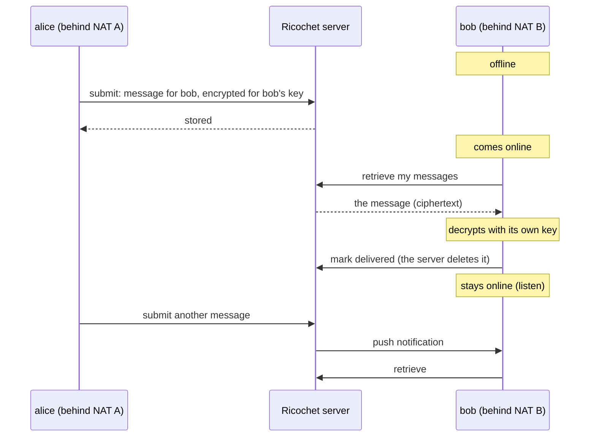

# Mailbox: messages for peers that are offline

Peer-to-peer messaging has a basic problem: the peer you write to is often
offline. This example solves it with a Ricochet server. A sender stores an
end-to-end encrypted message on the server, and the recipient collects it
whenever it next comes online. A recipient that stays online gets each new
message pushed to it.

The example is one small Go program, `mailbox`, built on this repository's
[`pkg/client`](../../pkg/client/). It has four commands:

| Command | What it does |
|---|---|
| `mailbox id` | Prints this peer's ID. Give it to the people who will write to you. |
| `mailbox send <peer-id> <text>` | Stores an encrypted message for a peer, online or not. |
| `mailbox inbox` | Prints the messages waiting for you, decrypted, and deletes them from the server. |
| `mailbox listen` | Prints what is waiting, then stays online and prints each new message as the server pushes it. |

## How it works



- **The client only dials out.** A client behind a NAT router opens a
  connection to the server, and the server pushes notifications back over
  that connection. Neither client has to be reachable.
- **The server is a libp2p peer.** It listens on UDX (a reliable transport
  over UDP), and every connection is encrypted with Noise. The server checks
  every request against the peer identity that the connection proved, so a
  client can only read its own mailbox.
- **Messages are end-to-end encrypted.** `send` encrypts the text with NaCl
  box for the recipient, with keys derived from the two peers' Ed25519
  identities. The server stores ciphertext that it cannot open. It still
  sees the envelope: who wrote to whom, when, and how large the message is.
- **Online means connected.** The server counts a client as online while
  the client has a connection to it, and then pushes each new message. An
  offline client finds its messages with `inbox` or `listen` when it
  returns.

## Run it with Docker

The `docker/` directory runs everything on one machine: PostgreSQL, the
server, and two clients, alice and bob, each on a private network behind its
own NAT router. The server sits on a network that stands in for the
internet. `demo.sh` plays the whole scenario:

```sh
cd examples/mailbox/docker
./demo.sh
```

```text
alice is 12D3KooWSTfHD9f5o3pz8RWko8PKzENtHumiQRcNR1KFgqjSTyog
bob   is 12D3KooWNgThKhH4Fye45QFtAm3rdsDkA4jaRBXTc8dzYyvwBwCQ

== bob is offline. alice sends him a message.
Stored for …vwBwCQ as message 43b299b9-c16c-449f-92e5-937e0c20ff1c

== bob comes online and collects it.
[04:17:38] …jSTyog: Hi bob, this waited for you on the server.

== bob stays online. alice sends again; the server pushes it to him.
Stored for …vwBwCQ as message fb928e90-8ce2-43bc-bc72-4b6aeba10767
Listening as 12D3KooWNgThKhH4Fye45QFtAm3rdsDkA4jaRBXTc8dzYyvwBwCQ. Ctrl-C to stop.
[04:17:42] …jSTyog: And this one was pushed to you.
```

To run the steps yourself:

```sh
docker compose up -d --build server nat-a nat-b
BOB=$(docker compose run --rm bob id)
docker compose run --rm alice send "$BOB" "hello bob"
docker compose run --rm bob inbox
```

The images build the server and the client from this repository's source.
Each client keeps its identity in a volume, so its peer ID survives the
`--rm`. `docker compose down -v` deletes everything, identities and stored
messages included.

## Run it over the internet

You need a host with a public IP address for the server, and PostgreSQL 14
or later.

**1. Set up the database.**

```sh
psql postgres -c "CREATE ROLE ricochet LOGIN PASSWORD 'secret'"
createdb ricochet
psql ricochet < schema.sql
```

**2. Build and start the server.** Open UDP port 55223 in the firewall.
`--external-addrs` gives the public address, which the server cannot see on
a cloud VM whose interface has a private address:

```sh
go build -o ricochet ./cmd/ricochet
export RICOCHET_PG_PASSWORD=secret
./ricochet --production --data-dir /var/lib/ricochet \
  --pg-host localhost --pg-database ricochet --pg-username ricochet \
  --external-addrs /ip4/203.0.113.7/udp/55223/udx
```

The server prints its peer ID:

```text
Ricochet server dev running. Peer ID: 12D3KooWBy8U1jGnja7zNiL5HiRL5wh37bKgiaSBNn5m74Atk2hv
```

Its identity key is `peer_identity.key` in the data directory. Keep that
file: the peer ID is part of the address that clients dial. To give the
server a fixed identity instead, pass `--identity-file` (that file, or a
32-byte seed as hex or base64) or set `RICOCHET_SEED_HEX`. (`--production`
expects TLS to PostgreSQL; add `--pg-sslmode disable` for a database on the
same host.)

**3. Use it from anywhere.** On each client machine:

```sh
go build -o mailbox ./examples/mailbox
export RICOCHET_SERVER=/ip4/203.0.113.7/udp/55223/udx/p2p/12D3KooWBy8U...
./mailbox -key alice.key id
./mailbox -key alice.key send 12D3KooWNgTh... "hello bob"
./mailbox -key bob.key listen
```

## The code

All of it is in [`main.go`](main.go), about 250 lines.

The host speaks what a Ricochet server speaks, and only needs to dial out:

```go
h, err := libp2p.New(
    libp2p.Identity(priv),
    libp2p.NoTransports,
    libp2p.Transport(udxtransport.NewTransport),
    libp2p.ListenAddrStrings("/ip4/0.0.0.0/udp/0/udx"),
    libp2p.Security(noise.ID, noise.New),
    libp2p.Muxer("/yamux/1.0.0", yamux.DefaultTransport),
)
h.Connect(ctx, *serverInfo)

cl := client.New(h, client.Config{
    PreferredServers: []client.ServerPreference{{PeerID: serverInfo.ID, Priority: 1}},
})
```

Sending encrypts for the recipient. A rejected message is a normal outcome,
so it comes back in the result rather than as an error:

```go
res, err := cl.SendMessage(ctx, recipient, []byte(text), client.WithEncryption())
if err == nil {
    err = res.Err() // for example client.ErrMailboxFull
}
```

Retrieving decrypts automatically. Retrieval never deletes anything; the
client acknowledges what it has handled:

```go
msgs, err := cl.RetrieveMessages(ctx)
for _, m := range msgs {
    fmt.Printf("%s: %s\n", m.SenderPeerID, m.Payload)
}
cl.MarkDelivered(ctx, ids)
```

Push needs only a handler and a connection that stays open:

```go
cl.RegisterNotificationHandler(func(n *wire.Notification) {
    // a message arrived for us: retrieve it
})
```

## Limits

- **The sender and the recipient use the same server.** A client delivers
  to its own preferred server, and that server stores the message for the
  recipient. There is no lookup yet of which server holds another peer's
  mailbox.
- **The envelope is visible to the server**: sender, recipient, time and
  size. Only the payload is encrypted.
- **No forward secrecy.** The encryption keys come from the peers' long-term
  identities, so a stolen identity key opens past messages too. An
  application that needs forward secrecy runs a ratchet, such as Signal's,
  on top.
- **Push needs a live connection.** A client behind a NAT router that drops
  idle UDP mappings quickly may lose its connection; `listen` checks every
  10 seconds and reconnects.
